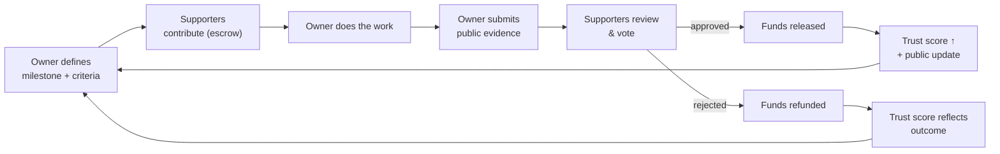
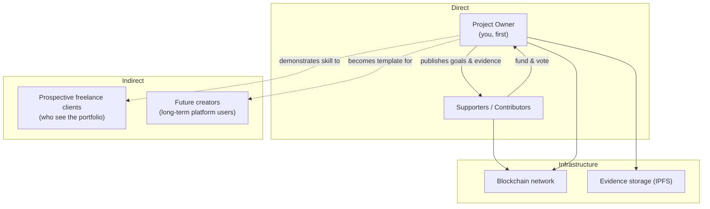

# 01 · Strategy Layer

> **Why this exists and who it serves.** Everything below this layer should be
> traceable to something here. If a feature doesn't serve the trust loop, question it.

## The one-sentence thesis

> Supporters fund **a transparent process**, not a person — money is held until
> verifiable progress is approved, so confidence comes from evidence rather than promises.

## Core philosophy → product mapping

Every philosophical commitment in the brief must show up as a concrete mechanism.
This table is the contract between *values* and *features*.

| Commitment | Mechanism that enforces it |
|------------|----------------------------|
| Trust the process, not the person | Funds in escrow; release gated by contributor vote |
| Supporters know what they fund | Milestones with explicit goals & success criteria |
| Supporters know progress is real | Public evidence (IPFS) tied to each milestone |
| Accountability over promises | On-chain refund if a milestone fails |
| Transparency is continuous | Regular public progress updates |
| Reputation is earned | Trust score derived from completion history |

## The trust loop (the heart of the product)

This is the cycle the whole platform exists to enable. If any arrow breaks, trust breaks.

## Stakeholders

## What "success" means at this layer

| Audience | They succeed when… |
|----------|--------------------|
| Supporter | They can answer "is real progress being made?" in under a minute, without trusting anyone's word. |
| Owner | Funding is unlocked by demonstrated work, and the build itself is a portfolio proof-point. |
| The platform | A stranger would feel safe contributing because the *process* protects them. |

## The meta-insight (why this project is special)

This platform is **simultaneously**:
- the **funding mechanism** for the owner's journey, and
- **Milestone 2 itself** (the blockchain portfolio project), and
- the **proof of skill** that helps win the freelance clients of Milestone 3.

→ Quality here compounds three ways. This justifies investing in doing it well.

## Decisions to make

### D1 · Testnet vs real money (v1)

| Option | Implication |
|--------|-------------|
| **Testnet (Sepolia)** | Zero legal/financial risk; optimize for "impressive & demoable"; real ETH never at stake. |
| **Real money (mainnet/L2)** | Holding strangers' funds in vote-gated escrow is, in most EU jurisdictions, a regulated financial activity — real compliance & custody exposure. |
| **Hybrid** | Build for real, launch on testnet, flip to mainnet only after proving it and assessing the legal side. |

> **Why it lives in Strategy:** this isn't a tech choice — it decides whether the
> product is a *showcase* or a *financial service*, which changes risk, scope, and tone.
> _Recommendation pending your input._

## Guiding principles (carried from the brief)

1. Transparency over trust.
2. Simple before clever.
3. Security before convenience.
4. Clear communication over unnecessary decentralization.
5. Solve the real, specific problem before generalizing.

> The litmus test for every feature: *"Does this make supporters feel more confident
> that meaningful progress is being made?"*
