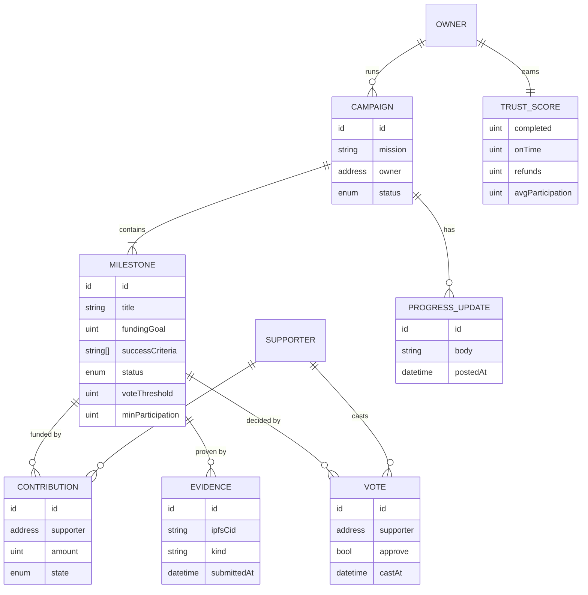
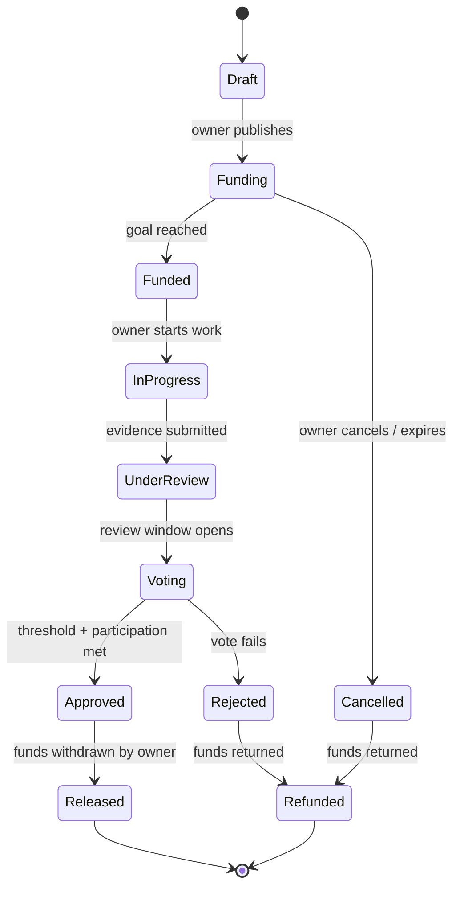
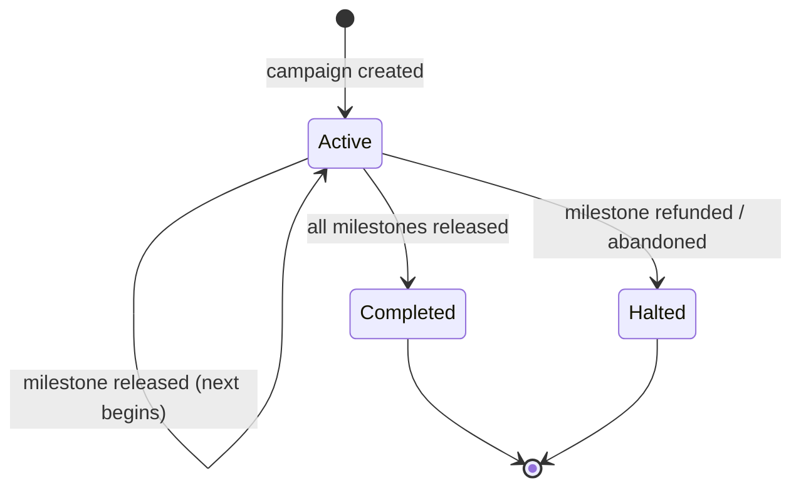
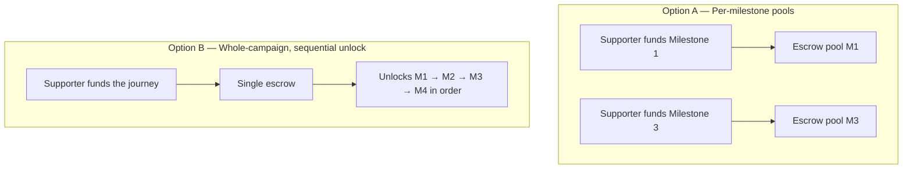

# 02 · Domain Model

> **The core concepts and their rules.** This is the shared vocabulary. Architecture,
> contracts, API, and UI all refer back to these terms with the same meaning.

## Glossary

| Term | Definition |
|------|------------|
| **Campaign** | A whole journey/mission owned by one person (e.g. "Become a freelancer & relocate"). Contains ordered milestones. |
| **Milestone** | A fundable unit of progress with a goal, success criteria, evidence, and a vote. |
| **Contribution** | Funds committed by a supporter, held in escrow against a milestone (or campaign — see D2). |
| **Escrow** | Held funds that cannot be moved by the owner until a vote approves release. |
| **Evidence** | Public proof a milestone's criteria were met (URLs, repo, video, docs), pinned to IPFS. |
| **Vote** | A contributor's approve/reject on a submitted milestone. |
| **Approval** | A milestone passing its vote (threshold + participation met) → funds release. |
| **Refund** | Return of escrowed funds to contributors when a milestone fails/stalls. |
| **Progress Update** | A timestamped public note from the owner — narrative, not gated by a vote. |
| **Trust Score** | A derived, public reputation metric based on the owner's track record. |

## Entities & relationships

> **Note on the split:** entities/fields shown here are the *conceptual* model. Which
> fields live **on-chain** (money, votes, state) vs **off-chain** (narrative, profiles,
> evidence metadata) is decided in [03-architecture](03-architecture.md). The domain
> model stays implementation-agnostic.

## Milestone lifecycle (state machine)

The milestone is the central state-bearing object. This is the single most important
diagram in the domain — contracts and UI both derive from it.

## Campaign lifecycle

## Key invariants (rules that must always hold)

These are the non-negotiables the contract layer must guarantee:

1. **No release without approval.** Owner cannot move escrowed funds unless a milestone reaches `Approved`.
2. **Conservation of funds.** Every contributed wei ends up either *released* or *refunded* — never stuck, never duplicated.
3. **One identity, one vote** (v1). Voting weight is per contributor, not per amount (weighted voting is a future version).
4. **Evidence precedes voting.** A milestone cannot enter `Voting` without submitted evidence.
5. **Refunds are pro-rata.** A refunded milestone returns each contributor exactly what they put in.
6. **Time-bounded votes.** Voting has a deadline; an undecided vote resolves to a defined default (see D4).

## Decisions to make

### D2 · Escrow model

| | Per-milestone (A) | Whole-campaign (B) |
|---|---|---|
| Supporter mindset | "I back *this* goal" | "I back the *journey*" |
| Refund logic | Clean, isolated per pool | Trickier across remaining milestones |
| Matches brief's per-milestone goals | ✅ | ⚠️ partial |
| Matches brief's "sequential unlock" wording | ⚠️ partial | ✅ |
| Contract complexity | More pools, more UX | Simpler accounting, sequencing logic |

> _Recommendation pending your input. This choice strongly shapes [04-smart-contracts](04-smart-contracts.md)._

### D4 · Undecided / stalled milestones

What happens when a vote deadline passes without meeting participation, or the owner
never submits evidence? Options to weigh later: auto-refund, grace period, owner
forfeit, or supporter-triggered claw-back. Tracked here; resolved in the contract layer.
