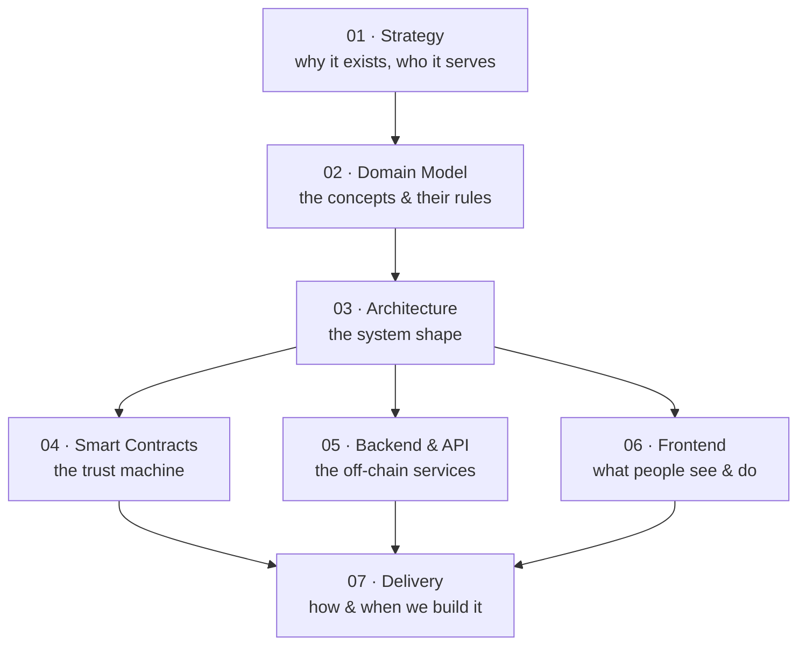

# Documentation Map

This folder lays out the **Milestone-Based Crowdfunding Platform** at every level —
from why it exists down to how each piece is built. The original intent lives in
[`../project_brief.md`](../project_brief.md); these documents turn that intent into
a navigable, decision-tracked structure.

## How to read this

The docs are layered. Read **top-down** for the full story (why → what → how), or
jump straight to the layer you care about.

| Layer | Document | Answers the question |
|-------|----------|----------------------|
| Strategy | [`01-strategy.md`](01-strategy.md) | Why does this exist and who is it for? |
| Domain | [`02-domain-model.md`](02-domain-model.md) | What are the core concepts and their rules? |
| Architecture | [`03-architecture.md`](03-architecture.md) | What is the overall system shape? |
| Smart Contracts | [`04-smart-contracts.md`](04-smart-contracts.md) | How is trust enforced on-chain? |
| Backend & API | [`05-backend-api.md`](05-backend-api.md) | What runs off-chain and why? |
| Frontend | [`06-frontend.md`](06-frontend.md) | What do supporters and the owner see and do? |
| Delivery | [`07-delivery.md`](07-delivery.md) | In what order do we build, and what are the risks? |

## Decisions not yet made

Rather than silently bake in assumptions, the big open forks are tracked where they
bite. Each appears as a **"Decisions to make"** block in the relevant doc and is
mirrored here so nothing gets lost.

| # | Decision | Lives in | Status |
|---|----------|----------|--------|
| D1 | **Testnet vs real money** for v1 (portfolio piece vs regulated fundraise) | [01](01-strategy.md), [03](03-architecture.md) | Open |
| D2 | **Escrow model**: per-milestone pools vs whole-campaign sequential unlock | [02](02-domain-model.md), [04](04-smart-contracts.md) | Open |
| D3 | **v1 scope**: thin (contract + frontend + IPFS) vs full MVP (adds backend + DB) | [03](03-architecture.md), [07](07-delivery.md) | Open |
| D4 | **Refund mechanics** when a milestone fails or stalls | [04](04-smart-contracts.md) | Open |
| D5 | **Identity**: wallet-only vs wallet + off-chain profile/auth | [05](05-backend-api.md) | Open |

## Plan of work (the meta-roadmap)

This is the order in which we flesh out *the project itself*, before any production code:

1. **Lock the strategy & domain** (layers 01–02) — agree on concepts and the trust loop.
2. **Resolve D1–D3** — these unblock real architecture choices.
3. **Detail architecture & contracts** (layers 03–04) — the riskiest, most design-heavy parts.
4. **Detail backend & frontend** (layers 05–06) — once the contract interface is stable.
5. **Sequence the build** (layer 07) — work breakdown, dependencies, first deliverable.

> Status: layers 01–02 drafted. Awaiting review before continuing.
